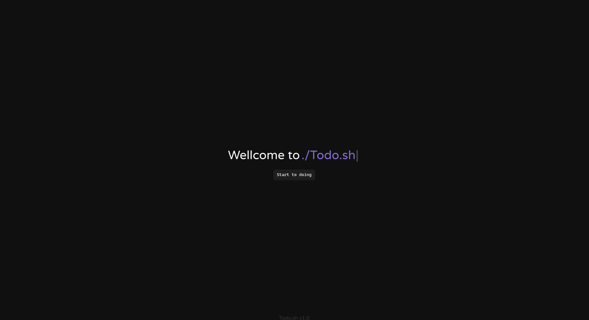

# 👽 Current state of the project

</img>

# 📋 About the project

This project was made basically to study how to make a full web aplication, from the front-end to de back-end, learning the whole process of making a web application.

# 👾 To test the front-end off the project

https://web-app-todo-sh.vercel.app/

### 🧠 Idea

The idea off the project, is a simple an fast todo list focused on the "Projects" to be done, setting a time to end a project, and finishing then on the time estimated, with two variations of project type "Todo (The common list)" and "Kanban (A Kanban style project management style)".

# 🤖 Tecnologies

- `NextJs`
- `Node`
- `Sass`
- `Mysql`
- `Drag & Drop`

# ✔️ Todo

- [x] Migrate to next
- [x] Routes
- [x] Php api 
- [x] Login & Register 
- [ ] Kanban drag and drop
- [ ] Fully connect db interactions
- [x] Full white theme configuration
- [ ] Fully ajust white theme